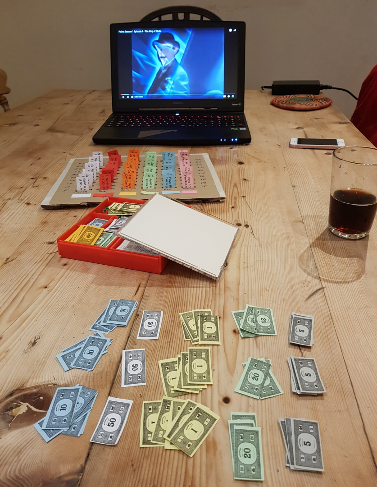

# What is this?
This is a video game, originally a [board game](https://www.overcomingbias.com/2018/08/my-market-board-game.html), about betting on murder mysteries. At least that's what it is on the surface! Really it is a bit deeper.

# Who made it?
The video game version was made by me, Hamish Todd. You can read more about me on my [personal website](http://hamishtodd1.github.io/). I have a PhD in molecular graphics and I'm generally interested in communication that uses interactive visualization. I'm @hamish_todd on twitter, and my email is my first name, then my surname, then the numeral 1, at gmail.

The original boardgame was created by social scientist Robin Hanson in 1989 as a way of exploring and illustrating a very interesting idea that he developed with Ron Fischer: Prediction Markets.

# What is a "Prediction Market"?
Murder She Bet (MSB) is an as-simple-as-possible example of a Prediction Market (PM), an institution that has enormous potential utility. Obvious uses include corporate and military strategy (Best Buy used them to decide on HD-DVD vs Blu-Ray, and the US military used them to predict terrorist attacks), but also for science funding, community organization, and politics. Prediction Markets encourage making probabilistic predictions where your beliefs and your levels of confidence in those beliefs both become explicit (although PMs are usually anonymous). This is a good thing -both for decision-making institutions and board games!- for three reasons:

1. Bayesian statistics is an objectively very helpful way to see the world, and you get better at it with practice. When playing MSB, people use it intuitively. Whenever, in the TV show, new information comes along (eg, "the victim changed their will"), there's a clear sense in which all the players "update" by thinking "would I see this evidence in the situation where suspect X hasn't done it? Would I see it in the situation situation where they have done it?", and adjust their bets accordingly. They even try to form a clear anticipation of something to happen in the next few scenes - you see them buying 3 bets, waiting, and then selling the bets if they don't see what they expected. It's science! Of a kind.

2. Humans often lie, including to themselves, about what they honestly believe is going to happen. But lying about your beliefs becomes basically impossible when there's a prediction market around. When you watch a murder mystery in the ordinary way, without MSB, you expect to see a lot of people posturing, saying crap like "oh well of COURSE X did it then, you'll see I'm right". With a prediction market, if a person *wants* to say something like that, everyone knows what they should do: *if they really believe 100% that that person is guilty*, they will buy every bet on that suspect. If they don't do this, i.e. they don't "put their money where their mouth is", you know they don't mean what they said.

3. Prediction markets aggregate information in a sophisticated way. As you play, you'll see that, at any given time, the price of a suspect's bets tells you the probability that the players ascribe to the belief that that suspect did it (because people who think the market price "should be higher" can buy a bet, and those who think it "should be lower" can sell bets). So now suppose you're an organization who has money to spend on acquiring information about the future, such as a scientific funding body, or a political party, or a firm. You want to find some "consensus opinion". You can set up a PM, with cash rewards, that will be played by everyone who has confidence in their knowledge of what questions your PM. From looking at the prices of bets on the different outcomes, you can figure out what the concensus is.

Hanson has written more on PMs to predict how scientific theories will hold up [(link)](http://mason.gmu.edu/~rhanson/futarchy.pdf), and even for deciding what policies to implement to give voters what they want out of a government [(link)](https://mason.gmu.edu/~rhanson/gamble.html).

# Original motivation: board game versus video game
I originally wanted to make this because I was interested in the difference between physical activities / board games and virtual activities / video games. Murder, She Bet exists as a board game; I wanted to compare it with what it's like as a video game. I originally started this project during my PhD, which was in part focussed on the related question of whether [Dynamicland](dynamicland.org) will turn out to be a good idea.

As a video game, Murder She Bet is:

* Easier to play quickly. Though harder for me to make!

* Allows more intellectual energy to be spent on decisions (instead of what bills to pay with)

* Can use your geometrical intuition in thinking about money and contracts. This is better because numerals require parsing. Comparative magnitudes are all that matter, and you get that from line lengths.

* Anonymous. You don't have to know who has bets in what. In the board game, this occupies your mind a bunch; you're asking "who, of these people I am playing with, is going to win?". But while being a very human question, that question is irrelevant to making decisions that will help you win. For example, it encourages holding grudges against people. Life lesson, I guess: you're able to make your life better faster if you spend less time holding grudges and comparing yourself to others!

* It's easier to remember which column goes with which suspect, because you can delete people with a single button press

* Is able to quickly set up a leaderboard at the end rather than a simple win/loss, so people's skill is more accurately and proportionately reported. This, I think, combats a problem pointed out by [Zvi Moshowitz](https://www.lesswrong.com/posts/fs2ozRQ4osJr9Wbfu/on-robin-hanson-s-board-game) that in the boardgame, that the endgame has distorted incentives that point away from buy bets that reflect your belief about the probability of a suspect's guilt. It's also more like a real-world stock market, where the goal is not to purely to be the one person at the very top, but simply to make decisions that get you the most money.

* Permits much more fine-grained betting, i.e. each suspect gets far more bets than in the boardgame. Many players believe that one bet on a suspect is a useful thing to have (this leads to people obsessing over the first bet). I am pretty sure that this isn't true; I certainly think it shouldn't be. At least if everyone is playing with the optimal strategy (see above), it's not about how many bets you have at a given time but about how good you are at judging probabilities, which should involve exchanging a very large number of bets. Having only one or two bets on a suspect should be a pathological situation encountered rarely in optimal play, because it means that the owners of the bets are having to "round their probability to the nearest bet".

# Other reasons I made this

* Visualizing mathematics is interesting. This is especially true of statistics. Statistics, as a field, is abstract and dry - but much as I love geometry, statistics is probably the most important area of mathematics, because almost all human thought is statistical, though people foolishly pretend it isn't.

* Using games to express sophisticated ideas is generally very interesting to me. Games are certainly good for expressing ideas when, as here, the idea is a system.

* ~~Prediction markets may or may not be a good idea~~ Edit: they are an extraordinarily good idea. The modern academic system, which is in the background of much of science, is just awful (especially for something that's supposed to, and sometimes does, produce great things). It's so sickening that we should consider any alternative whatsoever to be something worthy of serious consideration.

* Also, y'know, I want to signal tribal allegiance with rationalists and intelligence. For more on this, see Robin's book The Elephant In The Brain! One piece of evidence for this is that I always thought of my interest in games-as-communication as being mostly about level design, but Murder She bet has no level design.

# Specific pricing
I've tweaked the rewards a bit from the original, where the prices of contracts had to be multiples of 5. There's good reason to do this. One problem with discrete jumps, that the boardgame had is how the second smallest bet is TWICE as costly as the smallest bet. This is a bad discontinuity that many experienced game designers (at least those at Edinburgh Independent Game Developers) know to avoid!

If you'd like to fork this and change the prices, the important values are:
* pm.betsPerSuspect. In the original game this was *10*. I've increased this a lot, to 24, see above. This may feel a bit fiddly, but tough, that's the game

* cheapestBet, which is measured as a proportion of the money that a successful bet wins. Set this to *0.09* to get bet values similar to the original game.
    
* startingCash, which is measured as a proportion of the total price of 1 full column's worth of contracts. In the original game this is about *0.6*. Although possibly it should be measured as a proportion of the price per winning bet. I currently feel I have very little of idea what this "should" be. I think at least it should be uncommon, but not unheard of, for people to buy the most expensive bets before the endgame. Also, it should probably be impossible for someone to buy all the bets in a column at the beginning of a game and then just leave it at that. I suppose people in general should also have enough money to make any bet that they think will be worth it (a microcosm of the real world I guess!). I'm thinking of randomizing it a bit, to make it more of a microcosm of the real world; maybe you could rate players based not on how much the end up with but how much they increased their wealth?

# Credits
Camera click: Kwahmah https://freesound.org/people/kwahmah_02/sounds/260138/

Cash register: kiddpark https://freesound.org/people/kiddpark/sounds/201159/

Kick: soneproject https://freesound.org/people/soneproject/sounds/332362/

Take picture icon: https://icon-library.com/icon/take-picture-icon-10.html

Gavel: https://freesound.org/people/odditonic/sounds/187705/

Pop: LloydEvans09 https://freesound.org/people/LloydEvans09/sounds/321807/

Money: wobesound https://freesound.org/people/wobesound/sounds/488399/

Get Item: mrthenoronha https://freesound.org/people/Mrthenoronha/sounds/516824/

Yoink: fupicat https://freesound.org/people/Fupicat/sounds/538148/

Announcing sound: FoolBoyMedia https://freesound.org/people/FoolBoyMedia/sounds/234525/

The colorblindness-friendly color scheme for the bets is, of course, viridis, most badass of all color schemes, created by Nathaniel Smith and Stéfan van der Walt.

# License
MIT